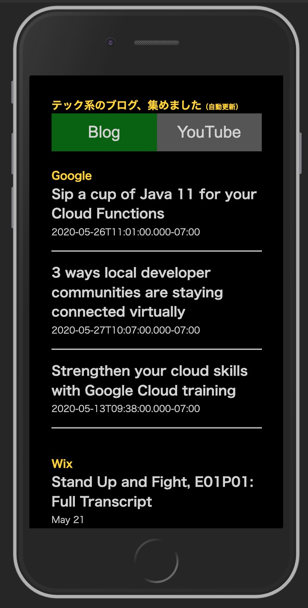

```
python 3.6.7
Django 3.0.6
```

create virtualenv & start Django

+ step1 http://localhost:8000/myfeed/myfeed/
+ step2 http://localhost:8000/myfeed/myfeed2/
+ step3 http://localhost:8000/myfeed/myfeed3/

step4 の前には、 loop_feed_main.py でデータベースに記事リストをストックしておく必要がある。
そのためには Postgres の実行環境が必要に。

+ step4 http://localhost:8000/myfeed/myfeed4/（上図）


```
Package                  Version   
------------------------ ----------
asgiref                  3.2.7     
beautifulsoup4           4.9.1     
cachetools               4.1.0     
certifi                  2020.4.5.1
chardet                  3.0.4     
Django                   3.0.6     
feedparser               5.2.1     
google-api-core          1.17.0    
google-api-python-client 1.8.3     
google-auth              1.15.0    
google-auth-httplib2     0.0.3     
googleapis-common-protos 1.51.0    
httplib2                 0.18.1    
idna                     2.9       
pip                      10.0.1    
protobuf                 3.12.1    
psycopg2                 2.8.5     
pyasn1                   0.4.8     
pyasn1-modules           0.2.8     
pytz                     2020.1    
requests                 2.23.0    
rsa                      4.0       
setuptools               46.4.0    
six                      1.15.0    
soupsieve                2.0.1     
sqlparse                 0.3.1     
uritemplate              3.0.1     
urllib3                  1.25.9 
```
